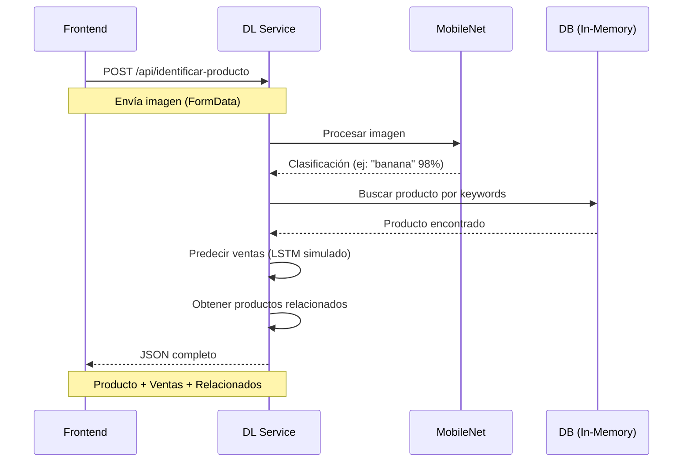

# 🧠 DL Service - API de Identificación de Productos

Microservicio de Deep Learning para identificación de productos por imagen, predicción de ventas y recomendaciones.

## 🚀 Estado del Servicio

- ✅ **Producción**: Servidor limpio y funcional
- ✅ **Puerto**: 8082
- ✅ **Modelo**: MobileNet v2 (TensorFlow.js)
- ✅ **Productos**: 46 productos en español
- ✅ **Categorías**: 8 categorías de supermercado

---

## 📡 Endpoint Principal

### `POST /api/identificar-producto`

Identifica un producto a partir de una imagen y devuelve:
- ✅ Información del producto (nombre, precio, stock, categoría)
- 📊 Predicción de ventas (próximos 7 días)
- 🔗 Productos relacionados

#### **Request**

**Headers:**
```
Content-Type: multipart/form-data
```

**Body:**
```
image: <archivo_imagen>
```

**Formatos soportados:**
- JPG, JPEG
- PNG
- GIF
- WEBP

**Tamaño máximo:** 10MB

#### **Ejemplo con cURL:**
```bash
curl -X POST http://localhost:8082/api/identificar-producto \
  -F "image=@producto.jpg"
```

#### **Ejemplo con JavaScript (Frontend):**

##### Opción 1: FormData (Drag & Drop)
```javascript
async function identificarProducto(file: File) {
  const formData = new FormData();
  formData.append('image', file);

  const response = await fetch('http://localhost:8082/api/identificar-producto', {
    method: 'POST',
    body: formData
  });

  return await response.json();
}

// Uso con drag & drop
dropZone.addEventListener('drop', async (e) => {
  e.preventDefault();
  const file = e.dataTransfer.files[0];
  const resultado = await identificarProducto(file);
  console.log(resultado);
});
```

##### Opción 2: Input file
```javascript
// HTML
<input type="file" id="imageInput" accept="image/*" />

// JavaScript
document.getElementById('imageInput').addEventListener('change', async (e) => {
  const file = e.target.files[0];
  const resultado = await identificarProducto(file);
  console.log(resultado);
});
```

#### **Response - Success (200)**

```json
{
  "success": true,
  "producto": {
    "id": 25,
    "nombre": "Plátano kg",
    "categoria": "Frutas",
    "precio": 0.8,
    "stock": 120,
    "keywords_mobilenet": ["banana"],
    "confianza": 0.9879185557365417
  },
  "prediccion_ventas": {
    "proximos_7_dias": [16, 15, 13, 12, 12, 13, 12],
    "tendencia": "decreciente",
    "promedio_diario": 13.3
  },
  "productos_relacionados": [
    {
      "id": 24,
      "nombre": "Manzana kg",
      "categoria": "Frutas",
      "score_relacion": 0.85,
      "razon": "Misma categoría"
    },
    {
      "id": 26,
      "nombre": "Naranja kg",
      "categoria": "Frutas",
      "score_relacion": 0.85,
      "razon": "Misma categoría"
    }
  ],
  "predicciones_raw": [
    {
      "clase_mobilenet": "banana",
      "probabilidad": 0.9879185557365417
    }
  ],
  "mensaje": "✅ Producto identificado: Plátano kg (98.8% confianza)",
  "imagen_url": "/uploads/1761333492233-1a4xlc.jpg",
  "timestamp": "2025-10-24T19:18:12.531Z"
}
```

#### **Response - Error (400/500)**

```json
{
  "success": false,
  "error": "No se proporcionó ninguna imagen",
  "mensaje": "Por favor, sube una imagen del producto"
}
```

```json
{
  "success": false,
  "error": "No se pudo identificar el producto en la imagen",
  "mensaje": "Intenta con otra imagen más clara",
  "predicciones_raw": [...]
}
```

---

## 🔍 Endpoints Auxiliares

### `GET /health`
Verifica el estado del servicio.

**Response:**
```json
{
  "status": "ok",
  "service": "DL Service - Identificación de Productos",
  "timestamp": "2025-10-24T19:16:37.652Z",
  "modelo": "MobileNet v2",
  "endpoints": {
    "identificar": "POST /api/identificar-producto"
  }
}
```

### `GET /api/productos`
Lista todos los productos disponibles en el sistema.

**Response:**
```json
{
  "total": 46,
  "categorias": ["Bebidas", "Lácteos", "Panadería", "Carnes", "Frutas", "Verduras", "Limpieza", "Snacks"],
  "productos": [
    {
      "id": 1,
      "nombre": "Coca Cola 2L",
      "categoria": "Bebidas",
      "precio": 1.8,
      "stock": 50,
      "keywords_mobilenet": ["water bottle", "pop bottle", "soda bottle"]
    }
  ]
}
```

### `GET /`
Información general del servicio.

**Response:**
```json
{
  "nombre": "DL Service - Identificación de Productos",
  "version": "1.0.0",
  "descripcion": "Microservicio de Deep Learning para identificación de productos por imagen",
  "modelo": "MobileNet v2",
  "productos": 46,
  "categorias": 8,
  "endpoints": {
    "identificar": "POST /api/identificar-producto",
    "health": "GET /health",
    "productos": "GET /api/productos"
  }
}
```

---

## 📦 Productos Disponibles

El sistema puede identificar **46 productos** organizados en **8 categorías**:

### 🥤 Bebidas (7 productos)
- Coca Cola 2L
- Pepsi 2L
- Fanta Naranja 2L
- Sprite 2L
- Agua Mineral 1.5L
- Jugo de Naranja Natural 1L
- Café Molido 250g

### 🥛 Lácteos (5 productos)
- Leche Entera 1L
- Yogur Natural 500g
- Queso Mozzarella 250g
- Mantequilla 250g
- Crema de Leche 200ml

### 🍞 Panadería (6 productos)
- Pan Blanco
- Pan Integral
- Croissant x3
- Galletas María 200g
- Tostadas Integrales 300g
- Medialunas x6

### 🥩 Carnes (5 productos)
- Carne Molida kg
- Pollo Entero kg
- Milanesas de Pollo kg
- Chorizo kg
- Jamón Cocido 200g

### 🍎 Frutas (6 productos)
- Manzana kg
- Plátano kg
- Naranja kg
- Frutillas 250g
- Uvas kg
- Pera kg

### 🥬 Verduras (6 productos)
- Tomate kg
- Lechuga
- Zanahoria kg
- Cebolla kg
- Papa kg
- Brócoli kg

### 🧼 Limpieza (5 productos)
- Detergente Líquido 1L
- Jabón en Polvo 1kg
- Lavandina 1L
- Esponja x3
- Papel Higiénico x4

### 🍿 Snacks (6 productos)
- Papas Fritas 150g
- Palitos Salados 100g
- Chocolate con Leche 100g
- Alfajor Triple
- Caramelos Masticables 100g
- Chicles 50g

---

## 🎯 Flujo de Trabajo



---

## 🚀 Integración Frontend

### Componente React (TypeScript)

```typescript
import React, { useState } from 'react';

interface ProductoIdentificado {
  success: boolean;
  producto?: {
    id: number;
    nombre: string;
    categoria: string;
    precio: number;
    stock: number;
    confianza: number;
  };
  prediccion_ventas?: {
    proximos_7_dias: number[];
    tendencia: string;
    promedio_diario: number;
  };
  productos_relacionados?: Array<{
    id: number;
    nombre: string;
    categoria: string;
    score_relacion: number;
    razon: string;
  }>;
  mensaje: string;
  error?: string;
}

export function ProductIdentifier() {
  const [resultado, setResultado] = useState<ProductoIdentificado | null>(null);
  const [loading, setLoading] = useState(false);
  const [error, setError] = useState<string | null>(null);

  const handleFileUpload = async (file: File) => {
    setLoading(true);
    setError(null);

    try {
      const formData = new FormData();
      formData.append('image', file);

      const response = await fetch('http://localhost:8082/api/identificar-producto', {
        method: 'POST',
        body: formData
      });

      const data = await response.json();
      setResultado(data);

      if (!data.success) {
        setError(data.mensaje || 'Error al identificar el producto');
      }
    } catch (err) {
      setError('Error de conexión con el servidor');
      console.error(err);
    } finally {
      setLoading(false);
    }
  };

  const handleDrop = (e: React.DragEvent) => {
    e.preventDefault();
    const file = e.dataTransfer.files[0];
    if (file && file.type.startsWith('image/')) {
      handleFileUpload(file);
    }
  };

  const handleFileSelect = (e: React.ChangeEvent<HTMLInputElement>) => {
    const file = e.target.files?.[0];
    if (file) {
      handleFileUpload(file);
    }
  };

  return (
    <div>
      <div
        onDrop={handleDrop}
        onDragOver={(e) => e.preventDefault()}
        style={{
          border: '2px dashed #ccc',
          padding: '40px',
          textAlign: 'center',
          cursor: 'pointer'
        }}
      >
        <input
          type="file"
          accept="image/*"
          onChange={handleFileSelect}
          style={{ display: 'none' }}
          id="fileInput"
        />
        <label htmlFor="fileInput" style={{ cursor: 'pointer' }}>
          📸 Arrastra una imagen o haz clic para seleccionar
        </label>
      </div>

      {loading && <p>⏳ Identificando producto...</p>}
      {error && <p style={{ color: 'red' }}>❌ {error}</p>}

      {resultado?.success && resultado.producto && (
        <div>
          <h2>✅ {resultado.producto.nombre}</h2>
          <p><strong>Categoría:</strong> {resultado.producto.categoria}</p>
          <p><strong>Precio:</strong> ${resultado.producto.precio}</p>
          <p><strong>Stock:</strong> {resultado.producto.stock} unidades</p>
          <p><strong>Confianza:</strong> {(resultado.producto.confianza * 100).toFixed(1)}%</p>

          {resultado.prediccion_ventas && (
            <div>
              <h3>📊 Predicción de Ventas</h3>
              <p><strong>Tendencia:</strong> {resultado.prediccion_ventas.tendencia}</p>
              <p><strong>Promedio diario:</strong> {resultado.prediccion_ventas.promedio_diario} unidades</p>
            </div>
          )}

          {resultado.productos_relacionados && resultado.productos_relacionados.length > 0 && (
            <div>
              <h3>🔗 Productos Relacionados</h3>
              <ul>
                {resultado.productos_relacionados.map((prod) => (
                  <li key={prod.id}>
                    {prod.nombre} - {prod.razon}
                  </li>
                ))}
              </ul>
            </div>
          )}
        </div>
      )}
    </div>
  );
}
```

---

## ⚙️ Ejecución

### Desarrollo
```bash
npm run dev
```

### Producción
```bash
npm run build
npm start
```

### Health Check
```bash
curl http://localhost:8082/health
```

---

## 🔧 Configuración

### Variables de Entorno
```bash
PORT=8082  # Puerto del servidor (default: 8082)
```

### CORS
El servicio acepta peticiones desde:
- `http://localhost:5173` (Vite default)
- `http://localhost:3000` (React default)
- `http://localhost:5174` (Vite alternate)

---

## 📝 Notas Importantes

1. **Sin Base de Datos Externa**: El servicio usa una base de datos en memoria con 46 productos predefinidos.

2. **Productos en Español**: Todos los nombres de productos están en español para match con el servicio transaccional.

3. **MobileNet Mapping**: El sistema mapea las clasificaciones de MobileNet (en inglés) a productos del supermercado (en español) usando keywords.

4. **Imágenes Guardadas**: Las imágenes subidas se guardan en `/uploads` con nombres únicos.

5. **Predicción de Ventas**: Actualmente es una simulación basada en categoría y stock (futuro: modelo LSTM real).

6. **Productos Relacionados**: Se calculan por categoría y se pueden mejorar con datos de compras frecuentes del servicio transaccional.

---

## 🎯 Próximos Pasos

- [ ] Integrar con servicio transaccional para sincronizar productos reales
- [ ] Implementar modelo LSTM real para predicción de ventas
- [ ] Mejorar productos relacionados con datos de compras frecuentes
- [ ] Agregar caché de imágenes procesadas
- [ ] Implementar modelo fine-tuned para productos específicos del supermercado

---

## 📞 Soporte

- **Puerto:** 8082
- **Health Check:** http://localhost:8082/health
- **Documentación:** Este archivo

