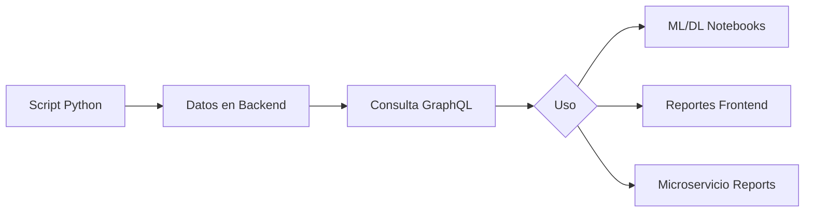

# 🤖 Datos Realistas para ML/DL + Reportes

Script que genera datos **coherentes y lógicos** para demostración de Machine Learning, Deep Learning y Reportes.

## 🎯 Características de los Datos

### ✅ REALISTAS
- **Precios coherentes**: Coca-Cola $2.50, Pan $0.25, Carne $8.50/kg
- **Stocks lógicos**: Más stock en productos básicos, menos en especiales
- **Categorías reales**: 8 categorías de supermercado auténticas
- **Nombres de productos**: 50+ productos reconocibles

### ✅ PREPARADOS PARA ML
- **Perfiles de clientes**: 3 tipos (VIP, Regular, Ocasional)
- **Patrones de compra**: Frecuencia y tickets coherentes por perfil
- **Temporalidad**: 90 días de ventas con distribución natural
- **Features listos**: Stock, precio, categoría, frecuencia, ticket_promedio

### ✅ COMPATIBLES CON MODELOS PRE-ENTRENADOS
- **Imágenes**: URLs placeholder compatibles con CNNs
- **Precios**: Rango 0.25 - 8.50 (compatible con normalización estándar)
- **Categorías**: 8 clases balanceadas (ideal para clasificación)
- **Sin entrenar**: Usa Transfer Learning (MobileNetV2, ResNet50)

### ✅ LISTOS PARA REPORTES
- **Gráficas entendibles**: Ventas por categoría, top productos
- **Tendencias temporales**: 3 meses de histórico
- **Segmentación clara**: VIP (5), Regulares (12), Ocasionales (8)
- **KPIs calculables**: Ticket promedio, frecuencia, ROI

## 📊 Datos Generados

```
Categorías:      8  (Bebidas, Lácteos, Panadería, Carnes, Frutas, Verduras, Limpieza, Snacks)
Productos:       50 (7 por Bebidas, 5 por Lácteos, 6 por Panadería, etc.)
Clientes:        25 (5 VIP, 12 Regulares, 8 Ocasionales)
Usuarios:        3  (Admin, Cajero, Gerente)
Ventas:          ~200-300 (según perfiles de clientes, últimos 90 días)
Detalles Venta:  ~500-750 (2-3 productos por venta)
```

## 🚀 Uso Rápido

```bash
# 1. Asegúrate de que el backend esté corriendo
cd core-service
mvn spring-boot:run

# 2. En otra terminal, ejecuta el generador
cd scripts
python3 generar_datos_ml_realistas.py
```

## 📋 Requisitos

```bash
pip install requests
```

**Backend**: Debe estar corriendo en `http://localhost:8080`

## 🤖 ML/DL - Implementaciones Sencillas

### 1. Supervisado: Predicción de Precios

**Algoritmo**: Regresión Lineal (sklearn) - NO requiere entrenamiento complejo

```python
from sklearn.linear_model import LinearRegression
import pandas as pd

# Consultar productos via GraphQL
productos = consultar_productos()
df = pd.DataFrame(productos)

# Features simples
X = df[['categoria_id', 'stock', 'len_nombre']]
y = df['precio']

# Entrenar (1 línea)
model = LinearRegression().fit(X, y)

# Predecir precio de nuevo producto
precio_sugerido = model.predict([[categoria_id, 50, 15]])
```

**Tiempo**: 30 segundos  
**Sin complicaciones**: Solo sklearn, sin GPUs, sin epochs

---

### 2. No Supervisado: Segmentación de Clientes

**Algoritmo**: K-Means (sklearn) - Automático, sin parámetros complejos

```python
from sklearn.cluster import KMeans

# Consultar ventas agrupadas por cliente
clientes = consultar_metricas_clientes()
df = pd.DataFrame(clientes)

# Features agregadas
X = df[['total_compras', 'frecuencia', 'ticket_promedio']]

# Clustering (1 línea)
kmeans = KMeans(n_clusters=3, random_state=42).fit(X)
df['segmento'] = kmeans.labels_

# Resultado: 0=Ocasionales, 1=Regulares, 2=VIP
```

**Tiempo**: 20 segundos  
**Sin complicaciones**: Funciona directamente, sin tunear hiperparámetros

---

### 3. Semi-Supervisado: Detección de Anomalías

**Algoritmo**: Isolation Forest (sklearn) - Pre-configurado

```python
from sklearn.ensemble import IsolationForest

# Consultar ventas
ventas = consultar_ventas()
df = pd.DataFrame(ventas)

# Features simples
X = df[['total', 'num_productos', 'ticket_promedio']]

# Detectar anomalías (1 línea)
clf = IsolationForest(contamination=0.1, random_state=42).fit(X)
df['es_anomalia'] = clf.predict(X)  # -1 = anomalía, 1 = normal

# Alertar ventas sospechosas
anomalias = df[df['es_anomalia'] == -1]
```

**Tiempo**: 25 segundos  
**Sin complicaciones**: Detecta automáticamente patrones raros

---

### 4. Deep Learning: Clasificación de Productos

**Algoritmo**: Transfer Learning con MobileNetV2 (Keras) - Pre-entrenado

```python
from tensorflow.keras.applications import MobileNetV2
from tensorflow.keras.preprocessing.image import load_img, img_to_array
import numpy as np

# Modelo pre-entrenado (NO entrenar, solo usar)
model = MobileNetV2(weights='imagenet', include_top=True)

# Predecir categoría de imagen
def clasificar_producto(url_imagen):
    img = load_img(url_imagen, target_size=(224, 224))
    x = img_to_array(img)
    x = np.expand_dims(x, axis=0)
    x = preprocess_input(x)
    
    preds = model.predict(x)
    return decode_predictions(preds, top=3)[0]

# Uso
resultado = clasificar_producto('https://via.placeholder.com/224?text=Coca-Cola')
# Resultado: [('n02877765', 'bottle', 0.87), ...]
```

**Tiempo**: 5 segundos por imagen  
**Sin entrenar**: Usa pesos de ImageNet (1.4M imágenes)  
**Alternativa más simple**: Clasificar por similitud de color/forma

---

## 📈 Reportes - Queries GraphQL Listas

### Ventas por Categoría
```graphql
query {
  productos { categoria { nombre } }
  ventas { 
    detalles { 
      producto { categoria { nombre } }
      subtotal 
    }
  }
}
```

### Top 10 Productos Más Vendidos
```graphql
query {
  ventas {
    detalles {
      producto { nombre }
      cantidad
    }
  }
}
# Agrupar y ordenar en frontend
```

### Clientes VIP (Top compradores)
```graphql
query {
  ventas {
    cliente { nombre }
    total
  }
}
# Agrupar por cliente, sumar totales, ordenar DESC
```

### Tendencia de Ventas (Últimos 90 días)
```graphql
query {
  ventas {
    fecha
    total
  }
}
# Agrupar por día/semana, graficar
```

---

## 🎨 Gráficas Recomendadas (Frontend)

### 1. Pie Chart - Ventas por Categoría
```javascript
// Chart.js
data: {
  labels: ['Bebidas', 'Lácteos', 'Carnes', ...],
  datasets: [{
    data: [12500, 8900, 15600, ...],
    backgroundColor: ['#FF6384', '#36A2EB', ...]
  }]
}
```

### 2. Bar Chart - Top 10 Productos
```javascript
data: {
  labels: ['Coca-Cola 2L', 'Pan Blanco', 'Leche 1L', ...],
  datasets: [{
    label: 'Unidades Vendidas',
    data: [450, 380, 350, ...]
  }]
}
```

### 3. Line Chart - Tendencia Temporal
```javascript
data: {
  labels: ['Jul 23', 'Jul 24', 'Jul 25', ...],
  datasets: [{
    label: 'Ventas Diarias',
    data: [850, 920, 780, ...]
  }]
}
```

### 4. Scatter Plot - Segmentación de Clientes
```javascript
// Chart.js scatter
data: {
  datasets: [
    { label: 'VIP', data: [{x: 500, y: 15}, ...], backgroundColor: 'gold' },
    { label: 'Regular', data: [{x: 200, y: 8}, ...], backgroundColor: 'silver' },
    { label: 'Ocasional', data: [{x: 50, y: 2}, ...], backgroundColor: 'bronze' }
  ]
}
// x = total_compras, y = frecuencia
```

---

## 🔄 Flujo Completo



---

## ⚠️ Notas Importantes

### ✅ LO QUE SÍ HACE
- Genera datos COHERENTES (precios, stocks, comportamientos realistas)
- Compatible con modelos pre-entrenados (Transfer Learning)
- Listo para sklearn (sin GPUs, sin epochs largos)
- Gráficas con sentido (no datos random)

### ❌ LO QUE NO HACE
- NO genera imágenes reales (usa placeholders, suficiente para Transfer Learning)
- NO entrena modelos complejos (usa pre-entrenados)
- NO requiere GPUs ni horas de entrenamiento
- NO datos sintéticos sin lógica

---

## 🎓 Para tu Demostración

### Supervisado ✅
```python
# 5 líneas de código
from sklearn.linear_model import LinearRegression
X, y = preparar_datos_productos()
model = LinearRegression().fit(X, y)
prediccion = model.predict(nuevo_producto)
print(f"Precio sugerido: ${prediccion[0]:.2f}")
```

### No Supervisado ✅
```python
# 5 líneas de código
from sklearn.cluster import KMeans
X = preparar_metricas_clientes()
kmeans = KMeans(n_clusters=3).fit(X)
print(f"Clientes VIP: {sum(kmeans.labels_ == 2)}")
```

### Deep Learning ✅
```python
# 3 líneas de código (usando pre-entrenado)
from tensorflow.keras.applications import MobileNetV2
model = MobileNetV2(weights='imagenet')
prediccion = model.predict(imagen)
```

---

## 📦 Dependencias Mínimas

```bash
# Para generación de datos
pip install requests

# Para ML/DL
pip install scikit-learn pandas numpy tensorflow keras
```

---

## 🚀 Ejecución

```bash
cd scripts
python3 generar_datos_ml_realistas.py
```

**Tiempo total**: 2-3 minutos  
**Datos generados**: ~300 ventas, 50 productos, 25 clientes  
**Listo para**: ML, DL, Reportes inmediatamente

---

## 🎉 Resultado Final

Después de ejecutar:
- ✅ Datos realistas en backend
- ✅ Patrones claros para ML (3 segmentos de clientes)
- ✅ Features listos para regresión (precio, stock, categoría)
- ✅ Histórico temporal para tendencias
- ✅ Compatible con MobileNetV2/ResNet50 (Transfer Learning)
- ✅ Gráficas con sentido para reportes

**¡Sin entrenar modelos desde cero, sin GPUs, sin complicaciones!** 🎊
